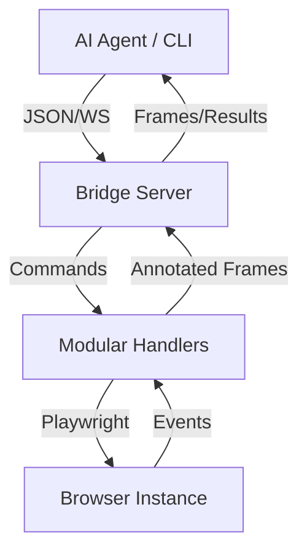

# OpenClaw Browser Bridge v3.2

> **The high-fidelity browser control layer for AI Agents.**
> Precise, Human-like, and Production-ready.

[](https://opensource.org/licenses/MIT)
[](https://playwright.dev/)

---

## 🌟 Why OpenClaw?

Most AI agents "guess" where to click using screenshots. OpenClaw provides a **DOM-first** approach:
- **99% Precision**: No more x,y coordinate guessing. Interact with elements using stable numerical IDs.
- **10x Token Efficiency**: Send a 200-token element list instead of a 2000-token high-res screenshot.
- **Anti-Detection**: Built-in human-like mouse movements (Bezier curves), varied typing speeds, and stealth scripts.
- **Cross-Platform**: Native CLI for Windows and Linux/macOS.
- **MCP-native**: Official stdio MCP server for Codex, Claude Desktop, and other MCP clients.
- **Traceable**: Session traces and benchmark artifacts for debugging, replay, and regressions.

---

## 🚀 Quick Start

### 1. Installation
```bash
git clone https://github.com/alexandre-leng/openclaw-browser-bridge.git
cd openclaw-browser-bridge
npm install
npx playwright install chromium
```

### 2. Launch the Bridge
```bash
npm start
```
- **Live Viewer**: `http://localhost:8080/viewer`
- **WebSocket**: `ws://localhost:8080/ws/browser-bridge`

### MCP Server
```bash
npm run mcp
```

After `npm run build`, the package exposes `openclaw-mcp`. The MCP server registers focused tools (`browser_status`, `navigate`, `annotate_page`, `click_ref`, `type_ref`, `extract_schema`). A low-level `browser_command` escape hatch is available behind `BRIDGE_MCP_ALLOW_RAW=1`.

---

## 🛠️ The `bridge` CLI

OpenClaw includes a powerful CLI to interact with the browser from any terminal or script.

### One-liner Workflows (Batch Mode)
Execute complex sequences in a single request to eliminate network latency:
```bash
.\bridge.cmd run "navigate google.com" "annotate" "click 7" "type 7 'weather paris'" "press Enter" "summary"
```

### Interactive REPL
Perfect for manual testing or continuous agent dialogue:
```bash
.\bridge.cmd repl
bridge> navigate https://google.com
bridge> annotate
bridge> click 7
```

---

## 🤖 Agent-Ready API

Designed specifically for LLMs (Claude, GPT, Gemini).

- **`page.annotate`**: Generates a numbered screenshot + structured element list.
- **`agent.click {ref: N}`**: Clicks the element with ID `N` using human-like motion.
- **`agent.type {ref: N, text: "..."}`**: Focuses and types with realistic delays.
- **`dom.extract {type: "search-results"|"form"|"table"}`**: Returns clean JSON instead of a wall of text.
- **`dom.extract {schema}`**: Extracts typed fields from CSS selectors.
- **`dom.extract {schema, llm: true}`**: Produces a strict JSON extraction prompt for an external LLM client.

Schema extraction example:
```json
{
  "type": "dom.extract",
  "payload": {
    "schema": {
      "fields": {
        "title": { "selector": "h1", "type": "string", "required": true },
        "links": { "selector": "a", "attribute": "href", "type": "array" }
      }
    }
  }
}
```

---

## 🏗️ Project Architecture



- **`src/browser/handlers/`**: Domain-driven command handlers (Navigation, DOM, Extraction...).
- **`src/browser/agent.ts`**: The "Eyes" — ARIA tree extraction and visual annotation.
- **`src/browser/human.ts`**: The "Hands" — Bezier mouse curves and typing jitter.
- **`src/transport/ws.ts`**: The "Nerves" — High-speed WebSocket communication.

---

## 🧪 Reliability & Testing

We take stability seriously. The bridge includes a comprehensive test suite powered by **Vitest**:
```bash
npm test
```
- ✅ **Resolver Integrity**: Ensures XPath/CSS/Text detection is flawless.
- ✅ **Human Dynamics**: Validates mouse movement physics and typing patterns.

---

## 🔐 Security & Environment Variables

| Variable | Role | Default |
|---|---|---|
| `PORT` | HTTP/WS port | `8080` |
| `BRIDGE_HOST` | Bind address | `127.0.0.1` |
| `BRIDGE_TOKEN` | WS auth token (`Authorization: Bearer <token>` or `?token=`). Required when binding outside localhost. | *(local only may be empty)* |
| `BRIDGE_ADMIN_TOKEN` | Token for `exec.script` when explicitly enabled | *(command disabled)* |
| `BRIDGE_ALLOW_EXEC_SCRIPT` | Enable arbitrary page JS eval when set to `1` | `0` |
| `BRIDGE_ALLOW_FILE_URLS` | Enable `file:` navigation when set to `1` | `0` |
| `BRIDGE_ALLOWED_FILE_ROOTS` | CSV allowlist of file roots for `file:` navigation | *(empty)* |
| `BRIDGE_POLITE_MODE` | Enable domain pacing and anti-bot detection (`0` disables) | `1` |
| `BRIDGE_POLITE_MIN_DELAY_MS` | Minimum delay between navigations to the same host | `12000` |
| `BRIDGE_ALLOWED_ORIGINS` | CSV of allowed `Origin` headers | *(any)* |
| `BRIDGE_DEFAULT_TIMEOUT_MS` | Default Playwright timeout | `15000` |
| `BRIDGE_DEFAULT_NAV_TIMEOUT_MS` | Default navigation timeout | `20000` |
| `BRIDGE_LOG_JSON` | Emit logs as JSON if `1` | `0` |
| `BRIDGE_LOG_LEVEL` | Minimum log level (`debug`/`info`/`warn`/`error`) | `info` |

Hardening: path-traversal guard on `/viewer/` & `/captures/`, WS `verifyClient` (Origin + token), token required outside localhost, URL allowlist (`http:`, `https:`, `about:` by default), explicit `file:` roots, explicit `exec.script` enablement, cookie structure validation, security headers (`X-Content-Type-Options`, `X-Frame-Options`, `Referrer-Policy`, viewer CSP), scrubbed error messages.

Polite browsing: OpenClaw slows repeated navigation to the same domain and stops automation if it detects an anti-bot verification page. This is a safety handoff, not a bypass.

## Use Cases

- **Local browser control**: give an AI agent a precise local browser bridge without a hosted browser dependency.
- **Human-in-the-loop**: run the browser visibly, inspect the viewer, and intervene manually when needed.
- **Light scraping**: extract forms, tables, article text, search results, or custom schema fields from pages you are allowed to access.
- **Agentic QA**: automate journeys with refs, screenshots, traces, and repeatable benchmark tasks.

## Benchmarks & Artifacts

```bash
npm run benchmark
```

The benchmark runs 20 local web tasks and reports success rate, average click/ref time, and estimated annotation token cost. JSON reports are written under `logs/benchmarks/`.

Every WebSocket command is recorded in an in-memory trace. Use:

- `trace.list` to inspect recent session events
- `trace.save` to persist a JSON artifact under `logs/traces/`
- `trace.artifacts` to list saved traces

## Demo Site Test

```bash
npm run test:site
```

This starts `examples/test-site/index.html` on a temporary localhost port, drives it with OpenClaw, chooses a plan by annotated ref, fills the checkout form, extracts the final state with a schema, and saves a trace artifact.

## 🧰 Scripts

```bash
npm start          # launch server
npm test           # vitest run
npm run typecheck  # tsc --noEmit
npm run lint       # eslint src + tests
npm run docs:api   # regenerate docs/api.md from registered handlers
npm run benchmark  # run 20-task local benchmark
npm run test:site  # run the demo site through OpenClaw
```

CI (`.github/workflows/ci.yml`) runs typecheck + lint + tests on every push/PR.

---

## 📄 License
MIT © 2025 Alexandre LENGEREAU
