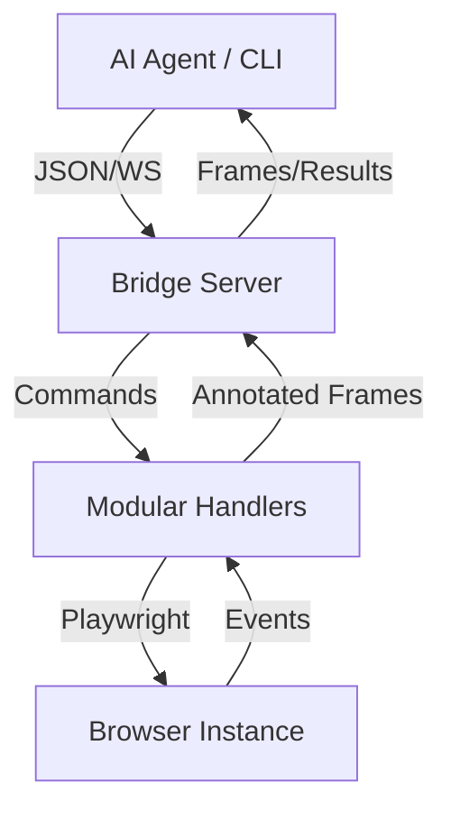

# 🦾 OpenClaw Browser Bridge v3.1

> **The high-fidelity browser control layer for AI Agents.**
> Precise, Human-like, and Production-ready.

[](https://opensource.org/licenses/MIT)
[](https://playwright.dev/)

---

## 🌟 Why OpenClaw?

Most AI agents "guess" where to click using screenshots. OpenClaw provides a **DOM-first** approach:
- **99% Precision**: No more x,y coordinate guessing. Interact with elements using stable numerical IDs.
- **10x Token Efficiency**: Send a 200-token element list instead of a 2000-token high-res screenshot.
- **Anti-Detection**: Built-in human-like mouse movements (Bezier curves), varied typing speeds, and stealth scripts.
- **Cross-Platform**: Native CLI for Windows and Linux/macOS.

---

## 🚀 Quick Start

### 1. Installation
```bash
git clone https://github.com/alexandre-leng/openclaw-browser-bridge.git
cd openclaw-browser-bridge
npm install
npx playwright install chromium
```

### 2. Launch the Bridge
```bash
npm start
```
- **Live Viewer**: `http://localhost:8080/viewer`
- **WebSocket**: `ws://localhost:8080/ws/browser-bridge`

---

## 🛠️ The `bridge` CLI

OpenClaw includes a powerful CLI to interact with the browser from any terminal or script.

### One-liner Workflows (Batch Mode)
Execute complex sequences in a single request to eliminate network latency:
```bash
.\bridge.cmd run "navigate google.com" "annotate" "click 7" "type 7 'weather paris'" "press Enter" "summary"
```

### Interactive REPL
Perfect for manual testing or continuous agent dialogue:
```bash
.\bridge.cmd repl
bridge> navigate https://google.com
bridge> annotate
bridge> click 7
```

---

## 🤖 Agent-Ready API

Designed specifically for LLMs (Claude, GPT, Gemini).

- **`page.annotate`**: Generates a numbered screenshot + structured element list.
- **`agent.click {ref: N}`**: Clicks the element with ID `N` using human-like motion.
- **`agent.type {ref: N, text: "..."}`**: Focuses and types with realistic delays.
- **`dom.extract {type: "search-results"|"form"|"table"}`**: Returns clean JSON instead of a wall of text.

---

## 🏗️ Project Architecture



- **`src/browser/handlers/`**: Domain-driven command handlers (Navigation, DOM, Extraction...).
- **`src/browser/agent.ts`**: The "Eyes" — ARIA tree extraction and visual annotation.
- **`src/browser/human.ts`**: The "Hands" — Bezier mouse curves and typing jitter.
- **`src/transport/ws.ts`**: The "Nerves" — High-speed WebSocket communication.

---

## 🧪 Reliability & Testing

We take stability seriously. The bridge includes a comprehensive test suite powered by **Vitest**:
```bash
npm test
```
- ✅ **Resolver Integrity**: Ensures XPath/CSS/Text detection is flawless.
- ✅ **Human Dynamics**: Validates mouse movement physics and typing patterns.

---

## 🔐 Security & Environment Variables

| Variable | Role | Default |
|---|---|---|
| `PORT` | HTTP/WS port | `8080` |
| `BRIDGE_HOST` | Bind address | `127.0.0.1` |
| `BRIDGE_TOKEN` | WS auth token (`Authorization: Bearer <token>` or `?token=`) | *(disabled)* |
| `BRIDGE_ADMIN_TOKEN` | Required for `exec.script` (arbitrary JS eval) | *(command disabled)* |
| `BRIDGE_ALLOWED_ORIGINS` | CSV of allowed `Origin` headers | *(any)* |
| `BRIDGE_DEFAULT_TIMEOUT_MS` | Default Playwright timeout | `15000` |
| `BRIDGE_DEFAULT_NAV_TIMEOUT_MS` | Default navigation timeout | `20000` |
| `BRIDGE_LOG_JSON` | Emit logs as JSON if `1` | `0` |
| `BRIDGE_LOG_LEVEL` | Minimum log level (`debug`/`info`/`warn`/`error`) | `info` |

Hardening: path-traversal guard on `/viewer/` & `/captures/`, WS `verifyClient` (Origin + token), URL allowlist (http/https/about/file), cookie structure validation, security headers (`X-Content-Type-Options`, `X-Frame-Options`, `Referrer-Policy`, viewer CSP), scrubbed error messages.

## 🧰 Scripts

```bash
npm start          # launch server
npm test           # vitest run
npm run typecheck  # tsc --noEmit
npm run lint       # eslint src + tests
npm run docs:api   # regenerate docs/api.md from registered handlers
```

CI (`.github/workflows/ci.yml`) runs typecheck + lint + tests on every push/PR.

---

## 📄 License
MIT © 2025 Alexandre LENGEREAU
