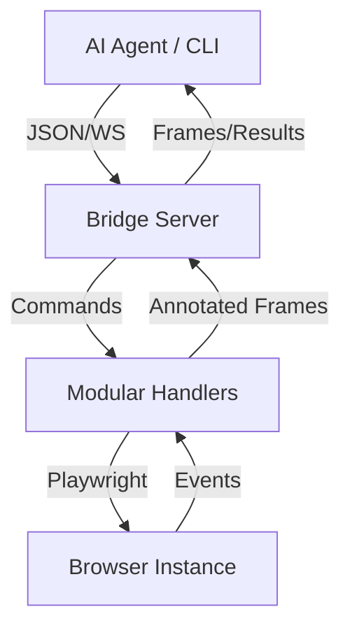

# AgentBridge v3.2

> **The high-fidelity browser control layer for AI Agents.**
> Precise, Human-like, and Production-ready.

[](https://opensource.org/licenses/MIT)
[](https://playwright.dev/)
[](https://github.com/alexandre-leng/agentbridge/actions/workflows/ci.yml)
[](https://www.npmjs.com/package/agentbridge)
[](https://github.com/alexandre-leng/AgentBridge-AI)

---

## 🌟 Why AgentBridge?

Most AI agents "guess" where to click using screenshots. AgentBridge provides a **DOM-first** approach:
- **99% Precision**: No more x,y coordinate guessing. Interact with elements using stable numerical IDs.
- **10x Token Efficiency**: Send a 200-token element list instead of a 2000-token high-res screenshot.
- **Anti-Detection**: Built-in human-like mouse movements (Bezier curves), varied typing speeds, and stealth scripts.
- **Cross-Platform**: Native CLI for Windows and Linux/macOS.
- **MCP-native**: Official stdio MCP server for Codex, Claude Desktop, and other MCP clients.
- **Traceable**: Session traces and benchmark artifacts for debugging, replay, and regressions.

---

## 🚀 Quick Start (2 minutes)

### 1. Install
```bash
npm install agentbridge
npx playwright install chromium
```

### 2. Launch
```bash
npm start
# → http://localhost:8080/viewer
# → ws://localhost:8080/ws/browser-bridge
```

### 3. Test it
```bash
# CLI
npx agentbridge-live navigate https://example.com

# Or open http://localhost:8080/viewer in your browser
```

### Docker (alternative)
```bash
docker build -t browser-bridge .
docker run -p 8080:8080 browser-bridge
```

### MCP Server
```bash
npm run mcp
```

After `npm run build`, the package exposes `agentbridge-mcp`. The MCP server registers focused tools (`browser_status`, `navigate`, `annotate_page`, `click_ref`, `type_ref`, `extract_schema`, `human_timing_get`, `human_timing_set`, `human_antispam_check`). A low-level `browser_command` escape hatch is available behind `BRIDGE_MCP_ALLOW_RAW=1`.

The MCP resource `api` (`agentbridge://api`) exposes the registered bridge command list, and the `browser_task` prompt gives agents a refs-first task template.

### Agent Skill Install

Install AgentBridge as an AgentSkills-compatible skill for local agents:

```bash
npm run build
npx agentbridge install openclaw --global
npx agentbridge install hermes
```

Targets:
- `openclaw`: writes `agentbridge/SKILL.md` and `PROMPTS.md` into `./skills` by default, or `~/.openclaw/skills` with `--global`.
- `hermes`: writes the skill into `~/.hermes/skills/agentbridge`.
- `all`: installs both adapters.

Use `--workspace <path>` to stage into a workspace instead of a user-level directory, and `--dry-run` to preview paths.

Reusable browser scripts can be run from JSON:

```bash
npx agentbridge script ./examples/browser-script.json
```

```json
{
  "steps": [
    { "type": "navigate", "url": "https://example.com" },
    { "type": "annotate" },
    { "type": "click", "ref": 3 },
    { "type": "summary" }
  ]
}
```

---

## 🛠️ The `bridge` CLI

AgentBridge includes a powerful CLI to interact with the browser from any terminal or script.

### One-liner Workflows (Batch Mode)
Execute complex sequences in a single request to eliminate network latency:
```bash
.\bridge.cmd run "navigate google.com" "annotate" "click 7" "type 7 'weather paris'" "press Enter" "summary"
```

### Interactive REPL
Perfect for manual testing or continuous agent dialogue:
```bash
.\bridge.cmd repl
bridge> navigate https://google.com
bridge> annotate
bridge> click 7
```

---

## 🤖 Agent-Ready API

Designed specifically for LLMs (Claude, GPT, Gemini).

- **`page.annotate`**: Generates a numbered screenshot + structured element list.
- **`agent.click {ref: N}`**: Clicks the element with ID `N` using human-like motion.
- **`agent.type {ref: N, text: "..."}`**: Focuses and types with realistic delays.
- **`web.search {query, limit?, engine?, pages?}`**: Searches the web, paginates, deduplicates URLs, and returns a run report.
- **`dom.extract {type: "search-results"|"form"|"table"|"google-maps"|"listings"|"marketplace"}`**: Returns clean JSON instead of a wall of text.
- **`dom.extract {schema}`**: Extracts typed fields from CSS selectors.
- **`dom.extract {schema, llm: true}`**: Produces a strict JSON extraction prompt for an external LLM client.
- **`dom.visibleText {filterAny, filterLines}`**: Extracts visible text with Windows-safe comma filters.
- **`human.clickText {text, timeoutMs}`**: Finds visible text, logs each stage, and falls back to ref-clicking when coordinate clicks fail.
- **`human.timing.*`**: Lets an agent read, tune, and reset consultation timings while a session is running.
- **`human.antispam.check`**: Returns a structured anti-spam warning without throwing, so an agent can pause or hand off cleanly.

### Runtime Human Timing

AgentBridge separates interaction speed from consultation speed. Mouse movement and typing stay humanized, while page-reading pauses can be adjusted live by the agent when a site starts reacting badly to rapid browsing.

```bash
node bridge-cli.cjs timing get
node bridge-cli.cjs timing set consultSpeed=1.6 minFocusedMs=3500 feedbackIntervalMs=800
node bridge-cli.cjs antispam
```

Typical agent loop:

1. Navigate or annotate.
2. Call `human.read`, `human.scan`, or `human.findText`.
3. Watch `human.feedback` WebSocket events for `phase`, `remainingMs`, `progress`, and active `timing`.
4. If the page feels sensitive, call `human.timing.set` with a higher `consultSpeed` or larger minimum pauses.
5. Call `human.antispam.check` before continuing with more clicks or searches.

`consultSpeed` is a multiplier: `1` is default, `1.5` is slower, `0.75` is faster. Prefer slowing down and handing off to a human if `human_antispam_check` reports a block; AgentBridge is designed for polite automation, not bypassing protections.

Schema extraction example:
```json
{
  "type": "dom.extract",
  "payload": {
    "schema": {
      "fields": {
        "title": { "selector": "h1", "type": "string", "required": true },
        "links": { "selector": "a", "attribute": "href", "type": "array" }
      }
    }
  }
}
```

---

## 🏗️ Project Architecture



- **`src/browser/handlers/`**: Domain-driven command handlers (Navigation, DOM, Extraction...).
- **`src/browser/agent.ts`**: The "Eyes" — ARIA tree extraction and visual annotation.
- **`src/browser/human.ts`**: The "Hands" — Bezier mouse curves and typing jitter.
- **`src/transport/ws.ts`**: The "Nerves" — High-speed WebSocket communication.

---

## 🧪 Reliability & Testing

We take stability seriously. The bridge includes a comprehensive test suite powered by **Vitest**:
```bash
npm test
```
- ✅ **Resolver Integrity**: Ensures XPath/CSS/Text detection is flawless. Empty/undefined queries now throw an explicit error (`dom.click: requires query, selector or text`) instead of crashing.
- ✅ **Human Dynamics**: Validates mouse movement physics and typing patterns.

---

## 👁️ Human Realism (`src/browser/human.ts`)

AgentBridge's anti-detection isn't just stealth scripts — every interaction is shaped to match human motor patterns.

| Aspect | Implementation |
|---|---|
| **Mouse trajectory** | Cubic Bezier with random arc, 24-90 steps adaptive to distance. Cursor position is tracked server-side, so each move starts from the real last position (no teleport from `(0,0)`). |
| **Mouse velocity** | **Smoothstep easing** `t' = t²(3-2t)` — slow start, fast middle, slow end. Linear `t` was a strong bot signal (constant velocity). |
| **Typing rhythm** | 40-160 ms per character, 3% chance of long pause (200-500 ms reflection). |
| **Typos & correction** | ~2.5% chance of pressing a QWERTY-neighbor key, then `Backspace`, then the correct key. The strongest defeat for keystroke-pattern detectors. |
| **Scroll inertia** | Wheel deltas follow exponential decay `e^(-1.2t)` — strong initial impulse then taper, mimicking real mouse-wheel physics. |
| **Visible cursor** | Red dot (turns green during click) painted via injected `<div>` with CSS `transition: transform 40ms linear`. The browser interpolates between updates, so we throttle paints to 1-in-3 steps to save IPC round-trips with no visual difference. Disable with `BRIDGE_VISIBLE_CURSOR=0`. |

Fine-tune at runtime:
```jsonc
{ "type": "human.timing.set", "payload": {
  "consultSpeed": 1.4,
  "minFocusedMs": 3000,
  "feedbackIntervalMs": 800
}}
```

---

## 🛡️ Stealth & Anti-detection (`src/browser/stealth.ts`)

Twelve patches injected via `addInitScript` before any page script executes:

| # | Patch | Purpose |
|---|---|---|
| 1 | `navigator.webdriver` → `undefined` | Defeats the most basic check. |
| 2 | `window.chrome` full object (`app`, `runtime`, `loadTimes`, `csi`) | Real Chrome has it — headless doesn't. |
| 3 | `navigator.plugins` (5 PDF viewers) | Empty plugins array is a headless signal. |
| 4 | `navigator.mimeTypes` | Coherent with plugins. |
| 5 | `navigator.languages` → `['fr-FR', 'fr', 'en-US', 'en']` | Matches the `locale` Playwright contextOpt. |
| 6 | `navigator.deviceMemory` → `8` | Default is missing in headless. |
| 7 | `navigator.hardwareConcurrency` → `8` | Same. |
| 8 | `Permissions.query` patched | `notifications` returns the real `Notification.permission` instead of leaking automation state. |
| 9 | Canvas fingerprint noise | Imperceptible per-session noise on `toDataURL` / `toBlob` defeats exact-hash fingerprinting. |
| 10 | WebGL `getParameter` | Returns `Google Inc. (Intel)` / `ANGLE Intel UHD Graphics 620 D3D11` for `UNMASKED_VENDOR_WEBGL` / `UNMASKED_RENDERER_WEBGL`. |
| 11 | `outerWidth/outerHeight` | Consistent with `innerWidth + 16/88` when `0` (headless signal). |
| 12 | Playwright globals | `__playwright`, `__pw_manual`, `__pwInitScripts` deleted. |

For aggressive anti-bots (Google, Cloudflare): **always set `CHROME_PROFILE` to a real Chrome profile**. This is the strongest signal — the stealth script alone can't replicate cookie history, TLS/JA3 fingerprint, or browsing habits.

---

## 🧬 Multi-session

Every WebSocket command accepts an optional `payload.sessionId`. The bridge routes via `AsyncLocalStorage` to an isolated Playwright context (separate cookies, tabs, storage):

```jsonc
{ "id": "1", "type": "session.create", "payload": { "sessionId": "alice" } }
{ "id": "2", "type": "navigate",       "payload": { "sessionId": "alice", "url": "https://example.com" } }
{ "id": "3", "type": "session.create", "payload": { "sessionId": "bob"   } }
{ "id": "4", "type": "navigate",       "payload": { "sessionId": "bob",   "url": "https://other.com"   } }
{ "id": "5", "type": "session.list" }
```

Commands without `sessionId` use a shared default context. The `BrowserController` keeps `Map<sessionId, Context>` and `Map<sessionId, Page>`.

---

## 📜 Complete command reference (~70)

Grouped by handler module. All accept optional `payload.sessionId`.

### Navigation (`handlers/navigation.ts`)
`navigate { url, waitUntil? }` · `search { engine, query }` · `dom.goto { url }`

### DOM semantic (`handlers/dom.ts`)
Every handler accepts `query` / `selector` / `text` (universal selector: XPath, CSS, or natural description).

`dom.click` · `dom.doubleClick` · `dom.hover` · `dom.type {value}` · `dom.press {key, waitForNavigation?}` · `dom.submit` · `dom.select {value}` · `dom.waitFor {state?, timeout?}` · `dom.html` · `dom.search {text}` · `dom.inspect` · `dom.scrollDown {amount?}` · `dom.scrollUp {amount?}` · `dom.fillForm {fields:[...]}`

### Agent IA — Antigravity-style (`handlers/agent.ts`)
`page.annotate { noImage? }` → `{ image, imageUrl, elements, url, title }`
`agent.summary` · `agent.tree` · `agent.click {ref, double?, retry?}` · `agent.type {ref, text, clearFirst?}` · `agent.press {key, ref?}` → `{ key, navigated, url, title }` · `agent.scroll {direction, amount?, x?, y?}` · `agent.discoverScroll {steps?, annotate?}` · `agent.waitFor {text? | url?, timeout?}` · `agent.hover {ref}` · `agent.select {ref, option}`

`ref` = numeric ID from last `page.annotate`, OR a natural description string (fuzzy match via Levenshtein, score ≥ 60).

### Raw input — viewer takeover, no humanization (`handlers/input.ts`)
`input.mouseMove {x, y}` · `input.mouseDown / input.mouseUp {x?, y?, button?}` · `input.wheel {x?, y?, deltaX?, deltaY?}` · `input.keyDown / input.keyUp {key}` · `input.text {text}` · `input.focus` · `viewport.set {width, height}`

### Extraction (`handlers/extraction.ts`)
`web.search {query, engine?, limit?, pages?, useForm?, organicOnly?}` runs a complete web search workflow and auto-paginates until enough deduplicated results are collected.
`dom.extract {type?, schema?}` supports `search-results`, `form`, `article`, `table`, `google-maps`, generic `listings`, and marketplace cards.
`dom.visibleText {query?, textFilter?, filterAny?, filterLines?, limit?, includeHidden?}`

Windows-safe CLI filtering:
```powershell
.\bridge.cmd visible-text --filter-any=Formation,IA,Marseille --filter-lines --limit=50
.\bridge.cmd scan --steps=4 --filter-any=Restaurant,Address
```

Generic listing extraction:
```bash
.\bridge.cmd extract listings
.\bridge.cmd extract marketplace --limit=10
.\bridge.cmd scrape --limit=10 --format=csv --out=results.csv
.\bridge.cmd webSearch "chats asiatique" --limit=20 --engine=google
```

### Human behavior (`handlers/special.ts`)
`human.timing.get / human.timing.set / human.timing.reset` · `human.antispam.check` · `human.read {durationMs?}` · `human.explore {steps?}` · `human.idle {durationMs?}` · `human.jitter {radius?, moves?}` · `human.skim {steps?, amount?}` · `human.backtrack` · `human.focusCycle` · `human.goBack` · `human.goForward` · `human.scan {filterAny?, filterLines?}` · `human.findText {text, timeoutMs?, consultMs?}` · `human.clickText {text, timeoutMs?, maxScrolls?}`

### Vision / Capture
`vision.start {fps?, annotate?}` · `vision.stop` · `vision.screenshot` · `screenshot {format?, fullPage?}`

### Sessions, tabs, cookies, traces (`handlers/session.ts`)
`session.create {sessionId}` · `session.list` · `browser.status` · `browser.close` · `trace.list` · `trace.save` · `trace.artifacts` · `cookie.get` · `cookie.set` · `tab.list` · `tab.new` · `tab.close` · `tab.switch` · `ping`

### Special (`handlers/special.ts`)
`exec.script {code}` (gated by `BRIDGE_ALLOW_EXEC_SCRIPT=1`) · `wait {ms}` · `combo.searchAndClick {query, engine?}` · `agent.search` · `agent.task`

---

## ⚡ Performance optimizations (v3.2)

| Hot path | Optimization | Gain |
|---|---|---|
| `annotateInteractive` | Overlay cleanup is fire-and-forget (auto-cleans on next call) | ~50 ms / call |
| `humanMove` cursor paint | Throttled to 1-in-3 steps; CSS `transition: 40ms linear` interpolates | ~3× fewer IPC |
| `humanScroll` cursor paint | Throttled to 1-in-2 steps | ~2× fewer IPC |
| `vision.ts` CSS dimensions | Cached, invalidated on `framenavigated` | 1 IPC saved per frame × FPS |
| `handlers/agent.ts` | Removed dynamic `await import('../human.js')` from `agent.scroll` and `agent.discoverScroll` | ~5 ms / call |
| `accessibilityTree` | Early-stops in `evaluate`, returns `{items, total}` | ~50 ms on `agent.summary` |
| `humanType` typos | Adds realism without measurable cost (Backspace + retype = ~300 ms when triggered ~2.5% of the time) | — |
| `__name` polyfill in `agent.ts` and `server.ts` | Defends against `tsx`/esbuild helper leakage inside browser-side `evaluate` callbacks — unblocks `page.annotate {noImage:true}` even when init scripts did not run in the target frame | — |

### Adaptive throttling (no more 12 s wasted on permissive sites)

Older versions enforced a hard `BRIDGE_POLITE_MIN_DELAY_MS=12000` and a 2.5 s warm-up on **every** navigation. v3.2 makes both adaptive:

- **Warm-up** is skipped if the same host was visited in the last 60 s (cookie banners and bot checks usually only fire on first contact).
- **Polite delay** is `0 ms` for hosts that haven't shown an anti-bot signal. As soon as `assertNoAntiBot` detects a verification page, the offending host is automatically promoted to "aggressive" and gets the full `BRIDGE_POLITE_MIN_DELAY_MS` between subsequent navigations.

Pre-seed known-aggressive hosts at startup:
```bash
BRIDGE_POLITE_FORCE_HOSTS=google.com,linkedin.com npm start
```

Disable politeness entirely for trusted environments (intranet, owned sites, test fixtures):
```bash
BRIDGE_POLITE_MODE=0 npm start
```

### Native batch handler

`script.execute` validates payload schemas and supports `${stepN.path}` variable interpolation between steps — perfect for orchestrated flows but expensive. For independent commands (parallel scraping, mass page-annotates), use the lighter `batch`:

```jsonc
{ "type": "batch", "payload": {
  "stopOnError": false,
  "commands": [
    { "type": "navigate",     "payload": { "url": "https://example.com" } },
    { "type": "page.annotate" },
    { "type": "agent.summary" }
  ]
}}
```

Returns `{ results: [{step, ok, type, result|error}, ...], durationMs, stepsExecuted }`. One WebSocket round-trip, no per-command overhead.

---

## 🔐 Security & Environment Variables

| Variable | Role | Default |
|---|---|---|
| `PORT` | HTTP/WS port | `8080` |
| `BRIDGE_HOST` | Bind address | `127.0.0.1` |
| `BRIDGE_URL` | WebSocket URL used by the TypeScript CLI | `ws://localhost:8080/ws/browser-bridge` |
| `BRIDGE_TOKEN` | WS auth token (`Authorization: Bearer <token>` or `?token=`). Required when binding outside localhost. | *(local only may be empty)* |
| `BRIDGE_ADMIN_TOKEN` | Token for `exec.script` when explicitly enabled | *(command disabled)* |
| `BRIDGE_ALLOW_EXEC_SCRIPT` | Enable arbitrary page JS eval when set to `1` | `0` |
| `BRIDGE_ALLOW_FILE_URLS` | Enable `file:` navigation when set to `1` | `0` |
| `BRIDGE_ALLOWED_FILE_ROOTS` | CSV allowlist of file roots for `file:` navigation | *(empty)* |
| `CHROME_CHANNEL` | Browser channel (`chrome`, `chromium`, `msedge`) | `chrome` |
| `CHROME_PROFILE` | Persistent browser profile directory | *(new context)* |
| `CHROME_CDP_URL` | Connect to an existing browser over CDP | *(empty)* |
| `BRIDGE_PLAYWRIGHT_SLOWMO_MS` | Playwright-level slow motion in milliseconds | `0` |
| `BRIDGE_BRING_TO_FRONT` | Bring the active page to front (`0` disables) | `1` |
| `BRIDGE_POLITE_MODE` | Enable domain pacing and anti-bot detection (`0` disables) | `1` |
| `BRIDGE_POLITE_MIN_DELAY_MS` | Minimum delay between navigations to the same host | `12000` |
| `BRIDGE_AUTO_COOKIES` | Automatically handle known cookie prompts (`0` disables) | `1` |
| `BRIDGE_HUMAN_WARMUP` | Human movement/pause warmup after navigation (`0` disables) | `1` |
| `BRIDGE_PAGE_WARMUP_MS` | Human warmup duration after navigation | `2500` |
| `BRIDGE_HUMAN_CONSULT_SPEED` | Initial multiplier for human consultation pauses | `BRIDGE_DEMO_SPEED` or `1` |
| `BRIDGE_DEMO_SPEED` | General multiplier for demo movement/pause timing | `1` |
| `BRIDGE_VISIBLE_CURSOR` | Show injected visible cursor (`0` disables) | `1` |
| `BRIDGE_ALLOWED_ORIGINS` | CSV of allowed `Origin` headers | *(any)* |
| `BRIDGE_DEFAULT_TIMEOUT_MS` | Default Playwright timeout | `15000` |
| `BRIDGE_DEFAULT_NAV_TIMEOUT_MS` | Default navigation timeout | `20000` |
| `BRIDGE_LOG_JSON` | Emit logs as JSON if `1` | `0` |
| `BRIDGE_LOG_LEVEL` | Minimum log level (`debug`/`info`/`warn`/`error`) | `info` |
| `BRIDGE_MCP_ALLOW_RAW` | Expose low-level MCP `browser_command` when set to `1` | `0` |

Hardening: path-traversal guard on `/viewer/` & `/captures/`, WS `verifyClient` (Origin + token), token required outside localhost, URL allowlist (`http:`, `https:`, `about:` by default), explicit `file:` roots, explicit `exec.script` enablement, cookie structure validation, security headers (`X-Content-Type-Options`, `X-Frame-Options`, `Referrer-Policy`, viewer CSP), scrubbed error messages.

Polite browsing: AgentBridge slows repeated navigation to the same domain and stops automation if it detects an anti-bot verification page. This is a safety handoff, not a bypass.

## Use Cases

- **Local browser control**: give an AI agent a precise local browser bridge without a hosted browser dependency.
- **Human-in-the-loop**: run the browser visibly, inspect the viewer, and intervene manually when needed.
- **Light scraping**: extract forms, tables, article text, search results, or custom schema fields from pages you are allowed to access.
- **Agentic QA**: automate journeys with refs, screenshots, traces, and repeatable benchmark tasks.

## Benchmarks & Artifacts

```bash
npm run benchmark
```

The benchmark runs 20 local web tasks and reports success rate, average click/ref time, and estimated annotation token cost. JSON reports are written under `logs/benchmarks/`.

Every WebSocket command is recorded in an in-memory trace. Use:

- `trace.list` to inspect recent session events
- `trace.save` to persist a JSON artifact under `logs/traces/`
- `trace.artifacts` to list saved traces


## 🧰 Scripts

```bash
npm start          # launch server
npm test           # vitest run
npm run typecheck  # tsc --noEmit
npm run lint       # eslint src + tests
npm run docs:api   # regenerate docs/api.md from registered handlers
npm run benchmark  # run 20-task local benchmark
```

CI (`.github/workflows/ci.yml`) runs typecheck + lint + tests on every push/PR.

---

## 📄 License
MIT © 2025 Alexandre LENGEREAU
